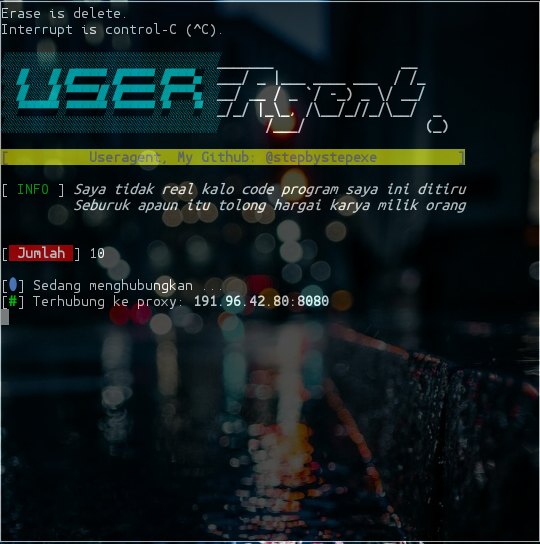

# Useragent:
*User Agent adalah informasi yang berisi identifikasi OS, browser, dan device yg dikirimkan oleh komputer ke webserver. Informasi user agent tersebut kemudian digunakan web server untuk mengirimkan konten yang sesuai dengan system dan device yang digunakan.*
#### Screenshot:

#### Cara Menginstall:
```
pkg update && pkg upgrade
apt-get install git
apt-get install python
git clone https://github.com/stepbystepexe/Useragent
cd Useragent
ls
python3 useragent.py
```
```
pip3 install -r requirement.txt
```
#### Kontak:
+ Email d_q16x@outlook.co.id
+ WhatsApp https://tinyurl.com/wel4alo
#### Paypal:
+ Onclick https://bit.ly/3dcEQcN
#### LiberaPay:
<noscript><a href="https://liberapay.com/stepbystepexe/donate"></a></noscript>
>**Created by Nedi Senja**
